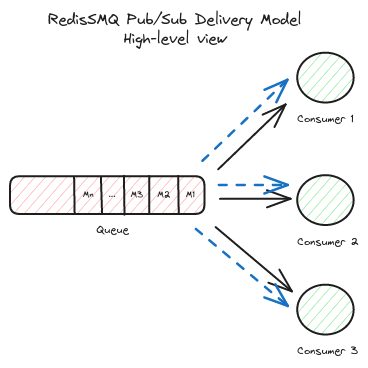
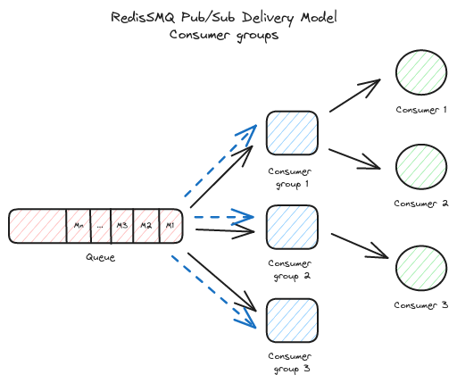

[RedisSMQ](../README.md) / [Docs](README.md) / Queue Delivery Models

# Queue Delivery Models

When it comes to message delivery RedisSMQ provides 2 reliable models: Point-2-Point and Pub/Sub.

## Point-2-Point Delivery Model


In the Point-2-Point model, a message is produced to a Point-2-Point queue and then delivered to and consumed by at a time only one consumer.

### Creating a Point-2-Point Queue

```javascript
const { Queue, EQueueDeliveryModel, EQueueType } = require('redis-smq');

const queue = new Queue();
queue.save('my-queue', EQueueType.LIFO_QUEUE, EQueueDeliveryModel.POINT_TO_POINT, (err, reply) => {
  if (err) console.error(err);
  else console.log('Successfully created', reply)
})
```

See [Queue.prototype.save()](api/classes/Queue.md#save) for more details.

### Publishing a Message to a Point-2-Point Queue

```javascript
const { Producer, ProducibleMessage } = require('redis-smq');

const message = new ProducibleMessage();
message.setBody('hello world').setQueue('my-queue');

const producer = new Producer();
producer.run((err) => {
  if (err) console.error(err);
  else producer.produce(message, (err, reply) => {
    if (err) console.error(err);
    else console.log('Successfully produced', reply);
  })
})
```

See [Producer.prototype.produce()](api/classes/Producer.md#produce) for more details.

### Consuming a message from a Point-2-Point Queue

```javascript
const { Consumer } = require('redis-smq');

const consumer = new Consumer();

const messageHandler = (msg, cb) => cb(); // acknowledging
consumer.consume('my-queue', messageHandler, (err) => {
  if (err) console.error(err);
  else console.log('MessageHandler added');
});
consumer.run((err) => {
  if (err) console.error(err);
})
```

## Pub/Sub Delivery Model

### Overview



In the Pub/Sub model, on the other hand, a message is delivered to and consumed by all consumers of a Pub/Sub queue.

From a high-level view the Pub/Sub model maybe illustrated as shown in the diagram above.

Each consumer receives and processes a copy of the produced message.

### Consumer Groups



To consume messages from a Pub/Sub queue, a consumer group is required.

In fact, when publishing a message to a pub/sub queue, the message is published to all consumer groups of the given queue.

Within a consumer group, only one consumer receives the message.

For a consumer group, unacknowledged messages are retried in the same manner as for a Point-2-Point queue.

When `retryTreshold` is exceeded failed messages from all consumer groups are stored, if configured to do so, in the dead-letter-queue of the given Pub/Sub queue.

### Creating a Pub/Sub Queue

```javascript
const { Queue, EQueueDeliveryModel, EQueueType } = require('redis-smq');

const queue = new Queue();
queue.save('my-pubsub-queue', EQueueType.LIFO_QUEUE, EQueueDeliveryModel.PUB_SUB, (err, reply) => {
  if (err) console.error(err);
  else console.log('Successfully created', reply)
})
```

See [Queue.prototype.save()](api/classes/Queue.md#save) for more details.

### Creating Consumer Groups

If it does not exist a consumer group of a given queue is created automatically when consuming messages from the queue.

Consumer groups may be also created manually using the [ConsumerGroups.saveConsumerGroup()](api/classes/ConsumerGroups.md) method.

See [ConsumerGroups](api/classes/ConsumerGroups.md) for managing consumer groups.

### Publishing a Message to a Pub/Sub Queue

```javascript
const { ProducibleMessage, Producer } = require('redis-smq');

const message = new ProducibleMessage();
message.setBody('hello world').setQueue('my-pubsub-queue');

const producer = new Producer();
producer.run((err) => {
  if (err) console.error(err);
  else producer.produce(message, (err, reply) => {
    if (err) console.error(err);
    else console.log('Successfully produced', reply);
  })
})
```

When producing a message to a Pub/Sub queue, if the queue has no consumer groups an error will be returned. 

So make sure the queue has at least one consumer group before publishing messages.

See [Producer.prototype.produce()](api/classes/Producer.md#produce) for more details.

### Consuming a message from a Pub/Sub Queue

```javascript
const { Consumer } = require('redis-smq');

const consumer = new Consumer();

const messageHandler = (msg, cb) => cb(); // acknowledging
consumer.consume({ queue: 'my-pubsub-queue', groupId: 'my-app-group-1' }, messageHandler, (err) => {
  if (err) console.error(err);
  else console.log('MessageHandler added');
});
consumer.run((err) => {
  if (err) console.error(err);
})
```

Please do not forget to provide the consumer group ID when consuming messages from a Pub/Sub queue.
